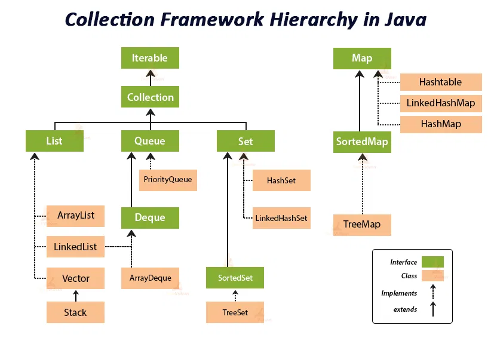

# Collections



__ArrayList__

Props:

- dynamic array, no size limit
- It is like the Vector in C++
- duplicate elements allowed
- non synchronized
- manipulation is little bit slower than the LinkedList, because a lot of shifting needs to occur if any element is removed from the array list

_IMP functions_

```java
ArrayList<String> list=new ArrayList<String>();
ArrayList<String> list2 = new ArrayList<String>(Arrays.asList("L", "M"));

list.add("A");
list.add(0, "B");
list.set(0, "C");

list.get(0);

// list.size();		// int
// list.isEmpty();	// boolean

list.remove("C");
list.remove(0);

list.removeRange(fromIndex, toIndex);
list.removeAll(list2);	// remove list2 elt
list.retailAll(list2);	// keep list2 elt

list.clear();	// Remove all

// list.contains("A")	// boolean
// list.indexOf("A");	// first occurrence or -1
// list.lastIndexOf("A")	// last occurrence or -1

// list.subList(0, 3)	// [0, 3)	// view
// list.equals(list2)	// boolean
```

_Interating_

```
// for loop
for(int i=0; i<list.size(); i++) {
	System.out.println(list.get(i));
}

// iterator
Iterator itr = list.iterator();
while(itr.hasNext()) {	// iterator has the elements  
	System.out.println(itr.next());	//printing and move to next  
}

// for each
for(String elt: list) {
	System.out.println(elt);
}

// *java8, forEach() and lambda expression
list.forEach(a->{ //Here, we are using lambda expression  
	System.out.println(a);  
});
```

_More functions_

```java
Collections.sort(list);
```

---

__LinkedList (+ Stack, Queue, Dequeue)__

Props:

- non synchronized
- can be used as a list, stack or queue

_IMP functions (most are same as ArrayList)_

```java
LinkedList<String> list = new LinkedList<String>();
LinkedList<String> list2 = new LinkedList<String>(Arrays.asList("A", "B", "C"));

list.add("A");
list.add(0, "B");
list.set(0, "C");

list.get(0);

// list.size();		// int
// list.isEmpty();	// boolean

list.remove("C");
list.remove(0);

list.removeAll(list2);	// remove list2 elt
list.retailAll(list2);	// keep list2 elt

list.clear();	// Remove all

// list.contains("A")	// boolean
// list.indexOf("A");	// first occurrence or -1
// list.lastIndexOf("A")	// last occurrence or -1

// list.subList(0, 3)	// [0, 3)	// view only, no modification
// list.equals(list2)	// boolean
```

_Interating forward_

```java
// same as ArraList
```

_Interating backward_

```
// for loop (basic)

// iterator
Iterator itr = list.descendingIterator();	// iterator over the elements in this deque in reverse sequential order
while(itr.hasNext()) {	// iterator has the elements  
	System.out.println(itr.next());	//printing and move to next  
}
```

_Other functions (different than ArrayList)_

```java
list.removeLastOccurrence("A");
list.addFirst("C");
list.addLast("D");

// list.getFirst();
// list.getLast();

list.removeFirst();		// returns value
list.removeLast();		// returns value

// list.peekFirst(); 	// null if list empty
// list.peekLast(); 	// null if list empty

// list.pop()
```

---

__HashSet/Treeset__

Props:

- no duplicate
- HashSet, order not maintained
- TreeSet, sorted in ascending order
- TreeSet can also be used like a PriorityQueue for removing the element with least or greatest priority
- Hashset gives better performance (faster) than Treeset for the operations like add, remove, contains, size etc. HashSet offers constant time cost while TreeSet offers log(n) time cost for such operations.

_IMP functions (common)_
```java
HashSet<Integer> mySet = new HashSet<Integer>();

mySet.add(1);
mySet.remove(1);

mySet.size();
// mySet.isEmpty();

// mySet.contains(5); 	// boolean

mySet.clear();
```

_Other functions (for TreeSet)_

```java
TreeSet<String> mySet = new TreeSet<String>();

// mySet.descendingSet();	// view

// mySet.first();	// first (lowest) element currently in this set
// mySet.last();	// last (highest) element currently in this set
```

_Interating_

```java
// same as ArraList
```

---

__HashMap/TreeMap__

Props:

- HashMap may have one null key and multiple null values
- non synchronized
- HashMap, order not maintained
- TreeMap, sorted in ascending order

_IMP functions_

```java
HashMap<Integer, String> myMap = new HashMap<Integer, String>();

myMap.put(1, "A");
myMap.putIfAbsent(1, "Z");	// If the specified key is not already associated with a value (or is mapped to null) associates it with the given value and returns null, else returns the current value

myMap.get(1);

myMap.remove(1);
myMap.remove(1, "A");	// Removes the entry for the specified key only if it is currently mapped to the specified value

myMap.replace(1, "A");	// Replaces the entry for the specified key only if it is currently mapped to some value

// myMap.size();	// keys
// myMap.isEmpty();		// boolean

// myMap.containsKey(1);	// boolean
// myMap.conatainsValue("B");	// boolean

// myMap.clear();	// removes all mappings

// myMap.entrySet();	// set view	// [1=A, 2=B, 3=C, 4=D]
// myMap.keySet()		// set view	// [1, 2, 3, 4]
// myMap.values();		// collection view

// myMap.putAll(myMap2);	// Copies all of the mappings from the specified map
```

_Other functions (for TreeMap)_

```java
TreeMap<Integer, String> myMap = new TreeMap<Integer, String>();

// myMap.firstEntry();	smallest key with key-value pair
// myMap.lastEntry();	largest key with key-value pair

// myMap.firstKey();	// smallest ket
// myMap.lastKey();		// largest key
```

_Interating_

```java
/* only keys or values */

for(Integer key: myMap.ketSet())
	System.out.println(key);
for(String val: myMap.values())
	System.out.println(val);

/* BOTH key and value*/

// iterator 1
for(Map.Entry<Integer, String> entry: myMap.entrySet()){
	System.out.println(entry.getKey() + "=" + entry.getValue());
}

// iterator 2
Iterator<Map.Entry<Integer, String>> itr = myMap.entrySet().iterator();
while(itr.hasNext()) {
	Map.Entry<Integer, String> entry = itr.next();
	System.out.println(entry.getKey() + "=" + entry.getValue());
}


// *java8, forEach() and lambda expression
myMap.forEach((k,v) -> {
	System.out.println(k + "=" + v);
});	
```

---

__Queue__

Props:

- Since Queue is an interface, objects cannot be created of the type queue. We always need a class which extends this list in order to create an object
- 


_IMP functions_

```java
Queue<Integer> myQ = new LinkedList<>();

myQ.add(ClassName ob); // adds ob to the queue , returns true if successful

myQ.element(); //retrieves but does not remove the first element in the queue , throws an exception if queue is empty

myQ.remove(); //returns and removes the head of the queue, throws an exception if queue is empty

myQ.isEmpty();//returns true if the queue is empty , false otherwise
myQ.size(); //returns the current size of the queue as an int
```

__Stack__

Props:

- 

_IMP functions_

```java
Stack<Integer> stk = new Stack<Integer>();

stk.push(5); //pushes 5 (can be any integer in this case (object in general)) on the top of the stack, returns the argument passed

stk.pop();  //removes the element at the top and return it

stk.peek(); //returns but does not remove the top most element

stk.empty(); //returns true iff stack doesn't contain any element, false otherwise

stk.size(); //number of elements in the stack
```

# Array

```java
String[] arr = new String[5];
String[] arr = {"a","b","c", "d", "e"};
String[] arr = new String[]{"a","b","c","d","e"};

// arr.length

int newArr[] = arr.clone();   // deep copy

// Arrays.binarySearch(arr, 3)	// returns index
// Arrays.equals(arr, arr2)		// boolean
// Arrays.fill(arr, 0);			// inplace
// Arrays.fill(arr, fromIndex, toIndex, 0);
// Arrays.sort(arr);			// inplace
// Arrays.toString(arr);

int[] newNrr = Arrays.copyOfRange(arr, fromIndex, toIndex);

/* Multidimensional Array */
int[][] myNumbers = { {1, 2, 3, 4}, {5, 6, 7} };
int[][] arr = new int[3][3];	//3 row and 3 column
```

_Other functions_

```java
/* Print Array without trversing*/
int[] intArray = { 1, 2, 3, 4, 5 };
String intArrayString = Arrays.toString(intArray);

System.out.println(intArrayString);		// [1, 2, 3, 4, 5]

/* ArrayList to Array */
String[] arr = new String[arrayList.size()];
arrayList.toArray(newArr);
```

# String

```java
String s1="Welcome";  
String s2="Welcome";//It doesn't create a new instance  
String s=new String("Welcome");

char[] helloArray = { 'h', 'e', 'l', 'l', 'o', '.' };
String helloString = new String(helloArray);

String s3 = Integer.toString(i); 

// s.charAt(2);
// s.length();

s.toLowerCase();
s.toUpperCase();
s.trim();	//removes beginning and ending spaces of this string

// s.substring(3)	// returns substring for given begin index.
// s.indexOf("co");	// or indexOf(String str, int fromIndex)
// s.indexOf(101);	// 101 = ASCII value of 'e' 
					// or (int ch, int fromIndex)
// s.lastIndexOf()	// same ans above two methods

// s.isEmpty();		// boolean

// s.equals(s2)		// boolean
// s.contains("com");	// boolean

// s.concat(s2)		// String view	// if s is null, NullPointerException
					// s2 must be a String
s = s + s2;	//	if s is null, works
			// it silently converts arg to String (using DataType.toString(val))
// s.replace("el", "xx");	// String view	// all occurences


String.join("xxx", "aaa", "bbb", ...)	// "aaaxxxbbb"	// String view

// s.startsWith("more");	// boolean 	// (String prefix, int toffset)
// s.endsWith("more");	// boolean

// s.toCharArray();
// s.getChars(0, s.length(), temp, 0); 	// Copies characters from a string to an array of chars
										// (int srcBegin, int srcEnd, char[] dst, int dstBegin)
// s.compareTo(s2) 	// 0 if equal // Compares two strings lexicographically
					// < 0, lexicographically less than the other string
					// > 0, lexicographically greater than the other string
// s.compareToIgnoreCase(s2) 	// Compares two strings lexicographically, ignoring case differences
```

# Math

```java
Math.abs(-4.7);
```

| Method 		| Description 												 | Return Type
|---			|---														 |---
| abs(x) 		| absolute value of x 										 | double/float/int/long
| sqrt(x) 		| square root of x 											 | double
| cbrt(x) 		| cube root of x 											 | double
| pow(x, y) 	| value of x to the power of y 								 | double
| floor(x) 		| value of x rounded down to its nearest integer 			 | double
| ceil(x) 		| value of x rounded up to its nearest integer 				 | double
| round(x) 		| value of x rounded to its nearest integer 				 | int
| hypot(x, y) 	| sqrt(x^2 +y^2) without intermediate overflow or underflow  | double
| log(x) 		| natural logarithm (base E) of x 							 | double
| log10(x) 		| base 10 logarithm of x 									 | double
| max(x, y) 	| number with the highest value 							 | double/float/int/long
| min(x, y) 	| number with the lowest value 								 | double/float/int/long
| 				| 															 |
| random() 		| random number between 0 and 1 							 | double
| sin(x) 		| sine of x (x is in radians) 								 | double
| sinh(x) 		| hyperbolic sine of a double value 						 | double
| cos(x) 		| cosine of x (x is in radians) 							 | double
| cosh(x) 		| hyperbolic cosine of a double value 						 | double
| tan(x) 		| tangent of an angle 										 | double
| tanh(x) 		| hyperbolic tangent of a double value 						 | double
| toDegrees(x) 	| radians to an approx. equivalent angle measured in degrees | double
| toRadians(x) 	| degrees to an approx. angle measured in radians 			 | double